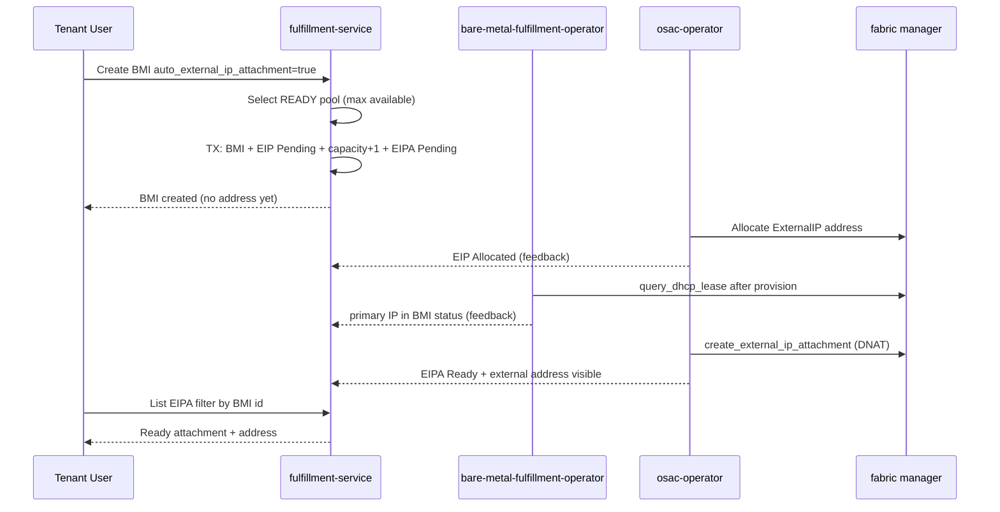
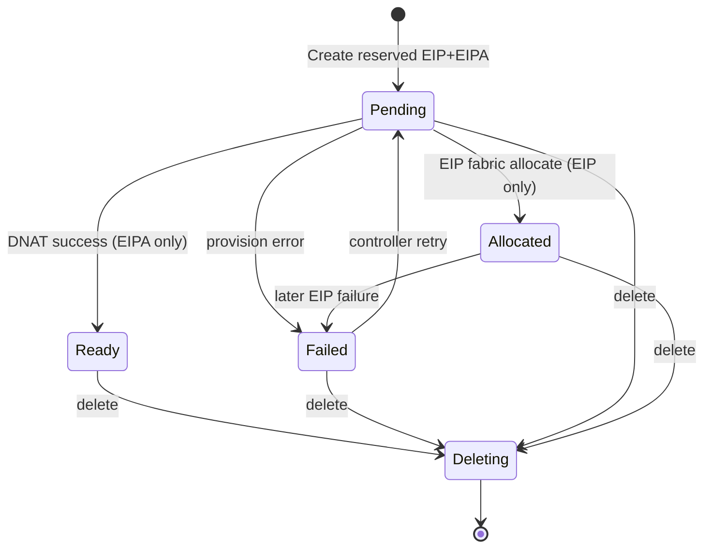

# BMaaS Automatic ExternalIP Lifecycle

## Summary

This design hardens the BMaaS `auto_external_ip_attachment` path: atomic synchronous
reservation of Pending ExternalIP and ExternalIPAttachment resources, asynchronous
progression to Allocated/Ready or Failed, a list/get UI query contract that never
assumes an address at create time, and label-scoped cleanup that removes only
auto-created children. See [PRD](../OSAC-1437-bmaas-networking/prd.md) for
requirements (FR-6, FR-9, FR-11, NFR-1). Implementation work is tracked under epic
[OSAC-4975](https://redhat.atlassian.net/browse/OSAC-4975)
([OSAC-4982](https://redhat.atlassian.net/browse/OSAC-4982) atomicity,
[OSAC-4984](https://redhat.atlassian.net/browse/OSAC-4984) tests,
[OSAC-4985](https://redhat.atlassian.net/browse/OSAC-4985) UI).

## Motivation

The OSAC-1437 design already sketched two-phase auto ExternalIP provisioning, and
much of the code exists. Gaps remain that block a reliable product experience:

- Create can leave partial BMI / capacity / child state when a mid-sequence step
  fails (OSAC-4982).
- UI and operators need a single documented state model: Pending does not mean
  “externally reachable,” and Failed must be visible without implying Ready.
- Cleanup ownership in the published OSAC-1437 design attributed BMI auto-EIP CR
  cleanup to osac-operator; the implemented finalizer lives in the
  bare-metal-fulfillment-operator, with an additional fulfillment-service Delete
  cascade. This document aligns the design with that reality.
- Sibling epic OSAC-4952 covers tenant attachment defaults/validation and is out
  of scope here.

### Goals

- Keep ExternalIPPool selection automatic on the auto path (no tenant-selected pool field).
- Make BMI create + ExternalIP + capacity accounting + ExternalIPAttachment one
  atomic synchronous unit with full rollback on any failure.
- Document Pending → Allocated/Ready → Failed/Deleting for EIP and EIPA, including
  UI and API observation rules.
- Define the public list/get query path and correlation metadata for auto resources.
- Define cleanup order and dual-plane ownership (API/DB vs CR) that deletes only
  auto-created EIP/EIPA and releases pool capacity.
- Reuse existing ExternalIP / ExternalIPAttachment APIs and CRDs — no new proto
  fields for correlation.

### Non-Goals

- Tenant network-attachment default resolution and validation (OSAC-4952).
- Changing CaaS/VMaaS auto ExternalIP beyond using them as pattern references.
- Fabric-manager implementation or new dispatcher roles.
- Tenant-selected ExternalIPPool on the auto path.
- A dedicated “get auto ExternalIP for BMI” RPC.

## Proposal

Fulfillment-service remains the control plane for reservation and API-visible
state. On BMI create with `auto_external_ip_attachment=true`, it selects a READY
pool, creates Pending ExternalIP and ExternalIPAttachment rows labeled as
auto-created, and decrements pool capacity inside one database transaction that
also covers the BMI insert. Operators then allocate the address, discover the BM
primary internal IP, and activate DNAT asynchronously. On BMI delete,
fulfillment-service cascade-deletes auto children in the API/DB plane; the
bare-metal-fulfillment-operator finalizer deletes matching CRs. Manually created
EIP/EIPA and default networking resources are never removed by this path.

### Workflow Description

**Actors:** Tenant User (create/delete BMI, view details); fulfillment-service;
bare-metal-fulfillment-operator (networking, IP discovery, CR cleanup finalizer);
osac-operator (ExternalIP + ExternalIPAttachment controllers and BMI feedback).

**Starting state:** Tenant has default networking (or explicit attachments). At
least one ExternalIPPool is READY with `available > 0`. Fabric manager is
configured on the NetworkClass.

#### Create and become reachable



This sequence separates the synchronous reservation (user gets a BMI immediately
with Pending EIP/EIPA) from asynchronous fabric work. The UI must poll or refetch
list/get until Ready; it must not treat create success as “External IP assigned.”

1. Tenant User creates a BareMetalInstance with `auto_external_ip_attachment=true`
   (CLI `--external-ip-attachment`, catalog wizard toggle, or API).
2. fulfillment-service validates BMI (including network attachments / defaults —
   attachment default rules are owned by OSAC-4952 / existing OSAC-1437 paths).
3. If auto flag is set and the request is not dry-run:
   - `SelectExternalIPPool`: READY pools with `available > 0`, highest available,
     tie-break by pool ID ascending. No IP-family filter unless a future BM
     constraint requires it (today UNSPECIFIED).
   - Create ExternalIP named `auto-eip-<shortId>` with labels
     `osac.openshift.io/auto-created=true`,
     `osac.openshift.io/auto-created-for=<bmi-id>`, annotation
     `osac.openshift.io/owner-reference=<bmi-id>`, `metadata.creator=system`,
     `status.state=PENDING`.
   - Lock BMI attachment references; `UpdatePoolCapacity(pool, +1)` under row lock.
   - Create ExternalIPAttachment named `auto-eipa-<shortId>` with the same
     auto-created labels/owner annotation, `spec.external_ip` and
     `spec.baremetal_instance` set, `status.state=PENDING`.
   - All of the above plus the BMI row commit in one RPC transaction. Any failure
     rolls back BMI, children, and capacity (OSAC-4982).
4. Create response returns the BMI. External address fields are empty.
5. osac-operator ExternalIP controller allocates via fabric → EIP
   `ALLOCATED` or `FAILED`.
6. BMFO completes inventory → provision → networking → reboot →
   `reconcileIPDiscovery`, writing primary `networkAttachmentStatuses[].ipAddress`.
7. osac-operator ExternalIPAttachment controller waits until EIP is Allocated and
   BMI primary IP is present, then creates DNAT → EIPA `READY` (or `FAILED`).
8. Tenant User (or UI) lists ExternalIPAttachments filtered by BMI id; when Ready,
   `status.external_ip_address` (or Get on the referenced ExternalIP) shows the
   public address.

#### Delete

1. Tenant User deletes the BareMetalInstance.
2. fulfillment-service `Delete`: if `auto_external_ip_attachment` was true, list
   ExternalIPAttachments with
   `this.metadata.labels['osac.openshift.io/auto-created-for'] == '<bmi-id>'`,
   then for each call `deleteAttachmentAndExternalIP` (attachment first, then EIP,
   capacity −1). Then delete the BMI.
3. Concurrently, BMFO `reconcileAutoCleanup` (finalizer
   `osac.openshift.io/baremetalinstance-cleanup`) lists CRs with
   `auto-created=true` and `auto-created-for=<bmi uuid label>`, deletes
   ExternalIPAttachment CRs, requeues until gone, then deletes ExternalIP CRs,
   then removes the finalizer.
4. Manually created EIP/EIPA (lacking auto-created-for for this BMI, or created
   without auto labels) are not selected by either path.
5. Default VN/subnet/SG/NATGateway are not deleted.

#### Error handling variations

- **No READY pool / capacity exhaustion / capacity race:** Create returns
  `FailedPrecondition` (or equivalent mapped public error). Zero BMI rows, zero
  auto children, unchanged pool counters.
- **Child create failure after BMI insert in same TX:** Entire TX rolls back;
  same empty outcome. Explicit reverse-order rollback helpers are required where
  the unit-test or non-interceptor path cannot rely on TX alone (OSAC-4982).
- **Async EIP Failed:** BMI continues provisioning/running without inbound
  access. Controllers retry per existing ExternalIP provisioning lifecycle.
  UI shows Failed and `status.message`.
- **Async EIPA Failed:** Same — BMI usable privately; Failed visible on
  attachment; automatic retry with backoff per proto lifecycle comments.
- **Cleanup transient failure:** BMFO finalizer requeues; fulfillment Delete
  returns error and does not remove the BMI until cascade succeeds.
- **Cleanup permanent CR failure:** After sustained retries, support may need
  manual CR deletion; design does not auto-orphan by removing the finalizer
  without operator policy (see Open Questions).

### API Extensions

No new gRPC services or CRDs. Behavior changes on existing surfaces:

| Surface | Change |
|---------|--------|
| `BareMetalInstances.Create` | When `spec.auto_external_ip_attachment=true`, atomically reserve Pending EIP+EIPA + capacity; fail closed on pool/capacity/child errors |
| `BareMetalInstances.Delete` | Cascade-delete only auto-created EIP/EIPA for the BMI before BMI delete |
| `BareMetalInstances.Update` | `auto_external_ip_attachment` remains immutable |
| `ExternalIPs` / `ExternalIPAttachments` List/Get | Unchanged; UI uses CEL filters + labels |
| BMFO finalizer | `osac.openshift.io/baremetalinstance-cleanup` on BMI CRs with auto children |
| ExternalIP / ExternalIPAttachment controllers | Unchanged BM target resolution and DNAT gating |

Proto field (already present):

```protobuf
// baremetal_instance_type.proto
optional bool auto_external_ip_attachment = 9
  [(google.api.field_behavior) = IMMUTABLE];
```

ExternalIP states used by this flow: `PENDING`, `ALLOCATED`, `FAILED`, `DELETING`.  
ExternalIPAttachment states: `PENDING`, `READY`, `FAILED`, `DELETING`.

## UX Alignment

Matching hooks exist under `osac-ui/libs/ui-components/src/api/v1/external-ip.ts`
and BMI details (`BareMetalNetworkingCard`).

| UI field / behavior | Proto / API | Notes |
|---|---|---|
| `spec.autoExternalIpAttachment` | `spec.auto_external_ip_attachment` | Direct mapping; immutable |
| Catalog wizard `attachExternalIp` | maps to `auto_external_ip_attachment` on create | Already present |
| Networking card: list attachments | `ExternalIPAttachments.List` filter `this.spec.baremetal_instance.id == "<bmi-id>"` | Documented query path |
| Auto vs manual | Prefer item with `metadata.labels["osac.openshift.io/auto-created"] == "true"` | Manual attachments may also reference the BMI |
| External address display | EIPA `status.external_ip_address` when Ready; else placeholder | Must not invent Ready from BMI create alone |
| Pending | EIPA or EIP `state == PENDING` | Show “Provisioning external access” (or equivalent), no address |
| Failed | `state == FAILED` + `status.message` | Danger/warning; no false Ready |
| Deleting / missing after BMI delete | List empty or DELETING | Cleanup / gone state |

No new anti-pattern deviations (no sub-resource action RPC, no K8s-internal fields in the public create contract).

### Implementation Details/Notes/Constraints

#### Atomic reservation (OSAC-4982)

Order inside the create RPC transaction:

1. Persist BMI (via existing `CreateWithCandidatePreparation`).
2. Select pool.
3. Create ExternalIP (Pending).
4. Lock attachment references.
5. Update pool capacity (+1).
6. Create ExternalIPAttachment (Pending).

On any error after step 1, roll back in reverse: delete attachment if present →
revert capacity → delete ExternalIP → delete BMI. Prefer the interceptor
transaction so a single `ReportError` aborts all DAO writes; still implement
explicit rollback helpers so unit tests and any path without a TX cannot leak
partial state.

Concurrent creates serialize on `UpdatePoolCapacity` (`SELECT FOR UPDATE`). With
`available=1`, exactly one create succeeds; the loser fails closed with no leak.

#### Correlation metadata

| Key | Value | Purpose |
|-----|-------|---------|
| label `osac.openshift.io/auto-created` | `true` | Distinguish auto from manual |
| label `osac.openshift.io/auto-created-for` | BMI id | Cascade cleanup + optional list filter |
| annotation `osac.openshift.io/owner-reference` | BMI id | Owner correlation |
| `metadata.tenant` | parent tenant | Tenant isolation |
| `metadata.creator` | `system` | Attribution |

#### State model (UI and API)



- **Pending (EIP):** reserved in DB; address not yet allocated.
- **Allocated (EIP):** address present; DNAT may still be Pending.
- **Pending (EIPA):** waiting for Allocated EIP and/or BMI primary IP.
- **Ready (EIPA):** DNAT active; safe to show public address as ready.
- **Failed:** visible via `status.state` + `status.message`; BMI is not rolled
  back after successful create.
- **Deleting:** cleanup in progress.

**UI readiness rule:** Treat external access as Ready only when the auto
ExternalIPAttachment is `READY` and an address is present. BMI create success,
EIP Pending, or EIPA Pending must render as in-progress placeholders.

#### Cleanup ownership

| Plane | Owner | Trigger | Selection |
|-------|-------|---------|-----------|
| API/DB | fulfillment-service `autoCleanupExternalIP` | BMI Delete RPC | EIPA with `auto-created-for=<bmi-id>` → delete attachment then EIP + capacity |
| CR | bare-metal-fulfillment-operator finalizer | BMI CR deletion | CRs with `auto-created` + `auto-created-for=<bmi uuid label>` → EIPA CRs then EIP CRs |

Both paths are required: API cascade keeps fulfillment consistent for clients;
CR finalizer prevents orphaned hub objects if DB delete and CR delete race.
Both are idempotent and label-scoped so manual resources are preserved.

#### Interface Changes (for testability)

## IC-1: Atomic auto ExternalIP reservation on BMI create

**Requirements:** FR-6, NFR-1

`BareMetalInstances.Create` with `auto_external_ip_attachment=true` selects pool,
creates Pending EIP+EIPA with correlation metadata, updates capacity, and commits
atomically with the BMI. Failure returns an error and leaves no BMI, no auto
children, and unchanged capacity. See atomic reservation above.

## IC-2: Asynchronous ExternalIP / attachment lifecycle observation

**Requirements:** FR-8, FR-9

After create, EIP progresses Pending→Allocated/Failed; EIPA progresses
Pending→Ready/Failed gated on Allocated EIP and BMI primary IP. Clients observe
via Get/List on existing resources (no new fields).

## IC-3: Label-scoped cleanup on BMI delete

**Requirements:** FR-11

BMI Delete removes only auto-created EIPA then EIP (capacity release). Manual
EIP/EIPA and default networking remain. BMFO finalizer mirrors CR deletion order.

## IC-4: UI networking detail contract for auto ExternalIP

**Requirements:** FR-6, FR-9, FR-11

BMI networking detail lists EIPA by `spec.baremetal_instance.id`, prefers
`auto-created=true`, renders Pending/Failed/Ready/cleanup placeholders, and never
assumes an address at create time (OSAC-4985).

FR-1 through FR-5, FR-7, FR-10, FR-12, and NFR-2 remain owned by the broader
OSAC-1437 design; this document does not redefine them.

### Security Considerations

Inherits the existing fulfillment authn/authz and tenant model. Auto-created
children copy `metadata.tenant` from the BMI and use the same tenancy filters on
List/Get. System `creator=system` does not bypass tenant isolation. No new
secrets or credentials are introduced. Correlation labels are not secrets but
must not be forgeable across tenants because create paths stamp them server-side
from the authenticated BMI id.

### Failure Handling and Recovery

| Failure | System behavior | User observation |
|---------|-----------------|------------------|
| No READY pool / available=0 | Create fails; TX rollback | Actionable FailedPrecondition; no BMI |
| Capacity race | Loser fails; winner Pending children | Error on loser; winner proceeds async |
| EIP/EIPA create error during reservation | Full rollback | Error; no BMI |
| EIP async Failed | Controller retries; BMI continues | EIP Failed + message; no public IP |
| Primary IP never appears | EIPA stays Pending | UI Pending placeholder |
| EIPA async Failed | Controller retries with backoff | EIPA Failed + message |
| Delete cascade error | BMI Delete fails; resources retained | Retry delete |
| CR cleanup requeue | Finalizer waits | BMI terminating until children gone |

Idempotency: re-listing by `auto-created-for` on repeated delete attempts is safe;
capacity updates are transactional with child deletes via
`externalIPLifecycle.deleteAttachmentAndExternalIP`.

### RBAC / Tenancy

No new roles. Tenant Users create/list/delete within their tenant. Auto children
are tenant-scoped. Platform admins using private APIs retain existing visibility.
`osac.openshift.io/tenant` and `owner-reference` continue to apply.

### Observability and Monitoring

Reuse existing structured logs and events. Required log/event signals for this
epic (emit if missing):

- Info: auto ExternalIP provisioned for BMI id / pool id
- Error: pool exhausted / capacity update failed / cascade cleanup failed
- Existing operator events for EIP/EIPA Failed and BMFO cleanup retries

No new metrics are required for the initial hardening; existing controller
reconcile latency and failure counts apply.

### Risks and Mitigations

| Risk | Mitigation |
|------|------------|
| Dual cleanup races leave orphans | Label-scoped idempotent deletes; E2E GC assertions (OSAC-4984) |
| UI shows Ready too early | Explicit Ready rule in IC-4; Vitest cases |
| Atomicity incomplete without TX | OSAC-4982 explicit rollback + concurrency tests |
| Design/code cleanup ownership drift | This document assigns CR cleanup to BMFO |

### Drawbacks

- Dual cleanup paths increase cognitive load versus a single owner; accepted
  because API and CR planes already diverge in OSAC.
- Async Failed leaves a running BMI without inbound access, which can confuse
  users expecting create-time reachability; mitigated by UI Pending/Failed states
  and docs.

## Alternatives (Not Implemented)

1. **Synchronous wait for Ready in Create**  
   Pros: UI simpler. Cons: violates NFR-1 intent for fast create, long timeouts,
   holds API TX across fabric. Rejected.

2. **Tenant-selected ExternalIPPool on auto path**  
   Pros: predictable addressing. Cons: contradicts automatic pool selection
   requirement; out of epic scope. Rejected for this epic.

3. **New GetAutoExternalAccess(bmi_id) RPC**  
   Pros: one-call UI. Cons: unnecessary given List filters + labels; more proto
   surface. Rejected.

4. **osac-operator owns BMI auto-EIP CR cleanup** (prior design text)  
   Pros: matches other networking CR owners. Cons: BMFO already owns BMI
   finalizers and IP discovery; moving cleanup splits BMI lifecycle. Rejected in
   favor of BMFO finalizer + fulfillment Delete cascade.

## Open Questions

### 9.1 Should permanent CR cleanup failure remove the BMI finalizer after N retries?

- **Owner:** Connectivity&Fabric (Dan Manor)
- **Impact:** Failure Handling; Support Procedures; risk of orphaned EIP CRs vs
  stuck Terminating BMI

### 9.2 Should EIP/EIPA Failed set a BMI status condition for UI convenience?

- **Owner:** Connectivity&Fabric + osac-ui
- **Impact:** IC-4; whether UI must always join List EIPA or can read BMI
  conditions alone

## Test Plan

Targeted by OSAC-4984 (integration/E2E) and OSAC-4982 (unit). Detailed behavioral
cases live in the workflow testplan artifact `04-testplan.md`.

### Unit Tests

- Pool exhaustion / no pool → error, no BMI, capacity unchanged
- EIP create failure, capacity update failure, EIPA create failure → full rollback
- Concurrent capacity=1 → exactly one success
- Success path → Pending EIP+EIPA with correct labels/annotations/tenant
- Delete cascade → auto children gone, capacity restored; manual EIP preserved
- Immutability of `auto_external_ip_attachment`

### Integration Tests

- Public/private Create with auto flag through real TX interceptor
- Controller path: Pending → Allocated/Ready after IP discovery (envtest or IT)
- Failed-state visibility on EIP/EIPA
- Metadata assertions for tenant and auto-created labels

### E2E Tests

- Extend `tests/e2e/bmaas/regression/networking/test_bmaas_networking.py`:
  happy path already covers Ready + GC; add exhaustion/rollback where harness
  allows; assert manual EIP survives BMI delete; document pool/fabric setup

### UI Tests (OSAC-4985)

- Vitest for Pending, Ready, Failed, missing resource, delayed address, auto vs
  manual distinction on `BareMetalNetworkingCard`

## Graduation Criteria

Not targeted as a separate graduated API. Ships as hardening of the existing
OSAC-1437 auto ExternalIP behavior. Done when OSAC-4982/4984/4985 acceptance
criteria pass and this design’s cleanup ownership is reflected in OSAC-1437
`design.md`.

## Upgrade / Downgrade Strategy

Additive behavior hardening. Existing BMIs with `auto_external_ip_attachment=true`
keep current labels. No migration. Downgrade may reintroduce partial-create leaks
if atomicity code is reverted — avoid reverting OSAC-4982 without feature flag.

## Version Skew Strategy

fulfillment-service atomic create can ship before UI Pending/Failed polish; old
UI may omit Failed presentation but must not crash. BMFO finalizer and
fulfillment cascade are independently safe if one side is temporarily older
(idempotent label deletes). EIP/EIPA controllers must remain compatible with
Pending attachments created at API time (already required).

## Support Procedures

| Symptom | Detection | Action |
|---------|-----------|--------|
| Create failed, no BMI | API error; pool `available` unchanged | Check READY pools / capacity |
| BMI without public IP | EIPA Pending/Failed; EIP state | Check fabric allocate; BMI primary IP; DNAT logs |
| BMI stuck Terminating | BMFO finalizer; leftover auto EIP CRs | Inspect cleanup logs; manually delete labeled CRs if safe |
| Orphan auto EIP after delete | List EIP by `auto-created-for` | Delete attachment then EIP; verify capacity |

Disable path: set `auto_external_ip_attachment=false` on new creates only
(immutable on existing). No webhook to disable.

## Infrastructure Needed

None beyond existing ExternalIPPool and fabric-manager lab setup already required
for BMaaS networking E2E.

---

## Provenance

Authored: draft @ design 0.11.3 - 9b25062, workspace OSAC-4975 @ dca3210df

<!-- ai-workflow-provenance:{"schema_version":1,"provenance_kind":"session","workflow":"design","workflow_version":"0.11.3","ai_workflows":"9b25062","source_repo":"dca3210df","source_repo_branch":"OSAC-4975","commits_behind_main":0,"commits_ahead_main":1448,"main_ref":"main","phases":["draft"],"authoring_modes":["skill"],"context_changed":false,"origin_untracked":false} -->
